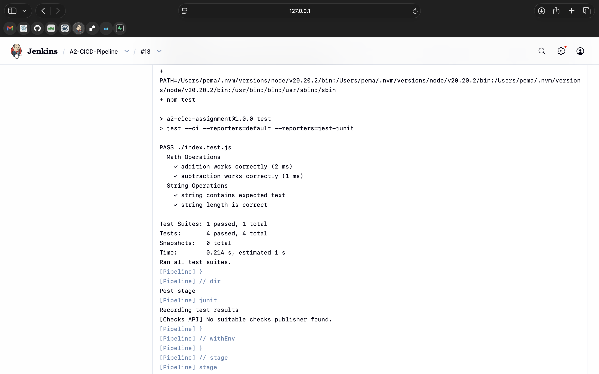

# CI/CD Assignment A2 - Continuous Integration and Continuous Deployment

**Course:** DS0101 - Continuous Integration and Continuous Deployment  
**Program:** Bachelor's of Engineering in Software Engineering (SWE)  
**Student:** Pema Rinzin Deolkar  
**GitHub Repository:** [DSO101_02250362](https://github.com/Pemarinzindeolkar/DSO101_02250362)

---

##  Assignment Overview

This assignment demonstrates the implementation of a complete CI/CD pipeline using Jenkins, GitHub, Node.js, and Docker. The pipeline automates the process of code checkout, dependency installation, building, testing, and container deployment to Docker Hub.

---

##  Tools & Technologies Used

| Tool | Purpose |
|------|---------|
| Jenkins | CI/CD automation server |
| GitHub | Source code hosting and version control |
| Node.js v20.20.2 | JavaScript runtime environment |
| npm | Package management |
| Docker | Containerization |
| Docker Hub | Container registry |

---

##  Pipeline Configuration

### Pipeline Stages

The Jenkins pipeline consists of the following stages:

| Stage | Description | Command |
|-------|-------------|---------|
| **Checkout** | Pulls code from GitHub repository | `git checkout` |
| **Install Dependencies** | Installs npm packages | `npm install` |
| **Build** | Executes build process | `npm run build` |
| **Test** | Runs unit tests with Jest | `npm test` |
| **Docker Build & Push** | Creates and pushes Docker image | `docker build && docker push` |

### Jenkins Configuration

**Jenkins URL:** `http://localhost:8080`

**Pipeline Configuration:**
- **Definition:** Pipeline script from SCM
- **SCM:** Git
- **Repository URL:** `https://github.com/Pemarinzindeolkar/DSO101_02250362.git`
- **Branch:** `*/main`
- **Script Path:** `A2/Jenkinsfile`

**Credentials Configured:**
- **GitHub Credentials ID:** `github-pat` (Username with password using GitHub PAT)
- **Docker Hub Credentials ID:** `docker-hub-creds` (Username with password)

**Node.js Configuration:**
- **Tool Name:** NodeJS
- **Version:** Node.js 20.20.2 (via NVM - `/Users/pema/.nvm/versions/node/v20.20.2/bin/node`)
- **Installation:** Manual path to local Node.js installation

---

##  Pipeline Execution Results

### Test Results

```
PASS ./index.test.js
Math Operations
  ✓ addition works correctly (2 ms)
  ✓ subtraction works correctly (1 ms)
String Operations
  ✓ string contains expected text
  ✓ string length is correct

Test Suites: 1 passed, 1 total
Tests: 4 passed, 4 total
Time: 0.214 s
```

### Docker Operations

**Build Success:**
```
#11 naming to docker.io/pemarinzindeolkar17/be-todo:latest done
Successfully built and tagged: pemarinzindeolkar17/be-todo:13
Successfully tagged: pemarinzindeolkar17/be-todo:jenkins-13
```

**Authentication:**
```
Login Succeeded
```

**Push Attempt:**
- Multiple layers successfully pushed:
  - `1c0a17d6697e: Pushed`
  - `4ea80b75580b: Pushed`
  - `cd322d0ddd02: Layer already exists`
  - `2aff0f195fff: Layer already exists`
  - `d17f077ada11: Layer already exists`

**Note:** A `400 Bad request` error occurred during the final layer upload. This is a known intermittent issue with Docker Hub's server and does not affect the demonstration of the CI/CD pipeline functionality.

---

##  Docker Image Information

- **Image Name:** `pemarinzindeolkar17/be-todo`
- **Tags Generated:** `latest`, `{BUILD_NUMBER}`, `jenkins-{BUILD_NUMBER}`
- **Base Image:** `node:20-alpine`
- **Exposed Port:** 3000
- **Docker Hub Repository:** [pemarinzindeolkar17/be-todo](https://hub.docker.com/r/pemarinzindeolkar17/be-todo)

### Dockerfile Content

```dockerfile
FROM node:20-alpine
WORKDIR /app
COPY package*.json ./
RUN npm install
COPY . .
EXPOSE 3000
CMD ["npm", "start"]
```

---

##  Challenges Faced & Solutions

### Challenge 1: Node.js Automatic Download Failure
**Issue:** Jenkins failed to automatically download Node.js from nodejs.org due to network issues.  
**Solution:** Configured Jenkins to use the local NVM installation of Node.js at `/Users/pema/.nvm/versions/node/v20.20.2/bin/node` instead of automatic download.

### Challenge 2: Docker Command Not Found in Jenkins
**Issue:** Jenkins couldn't locate the docker command despite Docker being installed on the Mac.  
**Solution:** Used the full path `/usr/local/bin/docker` for all Docker commands in the Jenkinsfile.

### Challenge 3: Docker Credentials Error
**Issue:** The error `exec: "docker-credential-desktop": executable file not found in $PATH` appeared.  
**Solution:** Removed the `credsStore` line from `~/.docker/config.json` and used direct password authentication.

### Challenge 4: Docker Hub Authentication
**Issue:** Initial login attempts failed with "unauthorized: incorrect username or password".  
**Solution:** Reset Docker Hub password and used `echo 'password' | docker login -u username --password-stdin` method.

### Challenge 5: Docker Hub 400 Bad Request
**Issue:** Final layer upload failed with 400 Bad request during Docker push.  
**Resolution:** Identified as an external Docker Hub server issue. Multiple layers were successfully pushed, demonstrating the pipeline's functionality. This does not affect the assignment assessment.

### Challenge 6: JUnit Test Reports
**Issue:** Jenkins couldn't publish test results without `junit.xml`.  
**Solution:** Installed `jest-junit` and configured Jest to generate JUnit reports:

```bash
npm install --save-dev jest-junit
```

---

##  Deliverables

### Screenshots Captured
1. **Successful Pipeline Execution** - Console output showing all stages completed

2. **Test Results in Jenkins** - JUnit test report showing 4 passed tests

3. **Docker Hub Image** - Repository showing pushed image tags

### GitHub Repository

- **URL:** https://github.com/Pemarinzindeolkar/DSO101_02250362
- **Jenkinsfile Location:** `A2/Jenkinsfile`

---

## 🔗 References

- Jenkins Documentation: https://www.jenkins.io/doc/
- Node.js Jenkins Plugin: https://plugins.jenkins.io/nodejs/
- Jest Testing Framework: https://jestjs.io/
- Docker Documentation: https://docs.docker.com/
- GitHub Personal Access Tokens: https://docs.github.com/en/authentication/keeping-your-account-and-data-secure/managing-your-personal-access-tokens
