# DSO101 Notes
**Course:** DS0101 - Continuous Integration and Continuous Deployment  
**Program:** Bachelor's of Engineering in Software Engineering (SWE)  
**Student:** Pema Rinzin Deolkar  
**GitHub Repository:** [DSO101_02250362](https://github.com/Pemarinzindeolkar/DSO101_02250362)

---

# Unit 1: Introduction to Docker

## What is Docker?

Docker is a platform used to develop, ship, and run applications inside containers. Containers package an application with all its dependencies, ensuring consistency across environments.

---

## Why Use Docker?

* Eliminates "works on my machine" problem
* Lightweight compared to virtual machines
* Faster deployment
* Easy scalability

---

## Docker vs Virtual Machines

| Feature     | Docker (Containers) | Virtual Machines |
| ----------- | ------------------- | ---------------- |
| Size        | Lightweight         | Heavy            |
| Boot Time   | Seconds             | Minutes          |
| Performance | Near-native         | Slower           |
| Isolation   | Process-level       | Full OS          |

---

## Docker Architecture

* **Docker Client** – Command line interface
* **Docker Daemon** – Runs containers
* **Docker Images** – Blueprints for containers
* **Docker Containers** – Running instances of images

---

## Basic Commands

```bash id="u1cmds"
docker --version
docker info
docker help
```
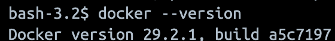
---

## Docker Lab

Lab Basic Commands

Lab consists of 17 questions, Answers are submitted below according to their question number.

1. 25.0.5
2. 0
3. 9
4. 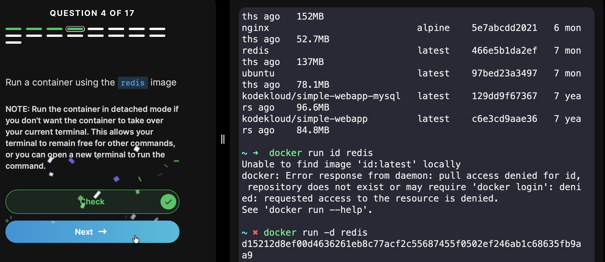
5. 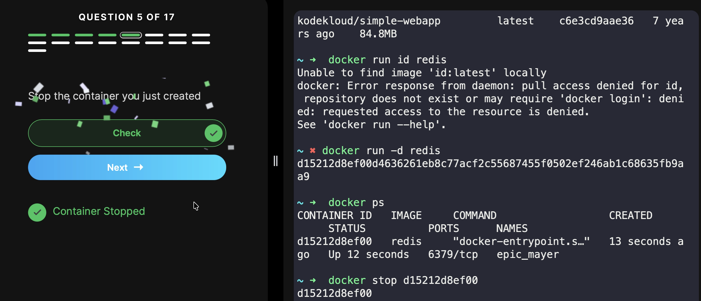
6. 0
7. 4
8. 6
9. nginx:alpine
10. awesome_northcut
11. 866
12. Exited
13. 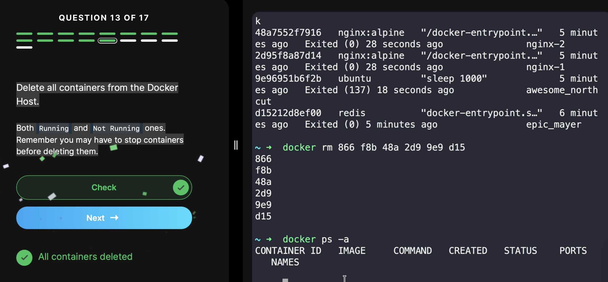
14. 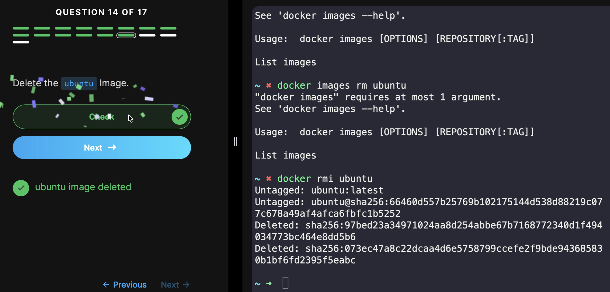
15. 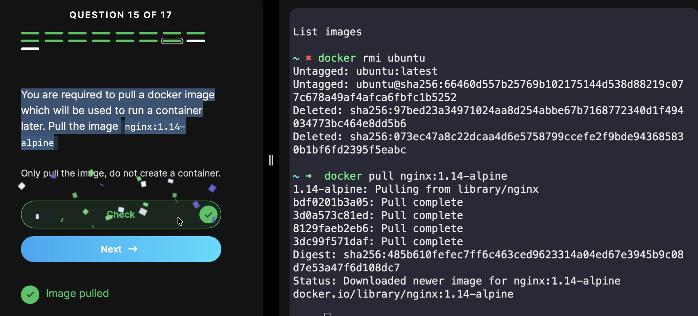
16. 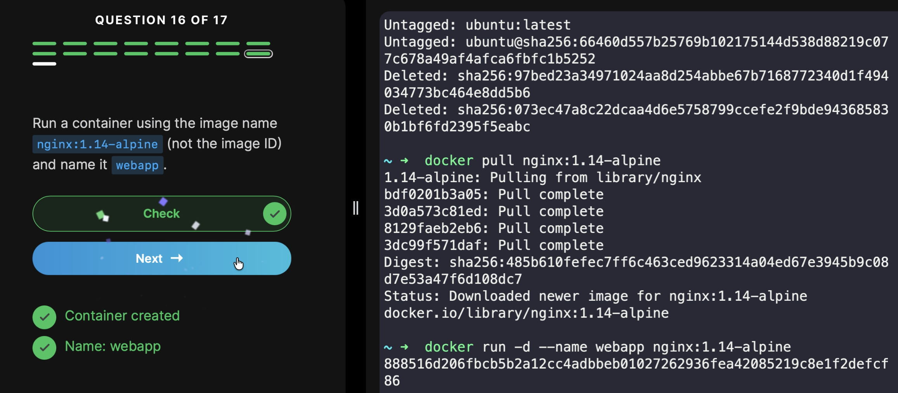

## Completion of Lab
 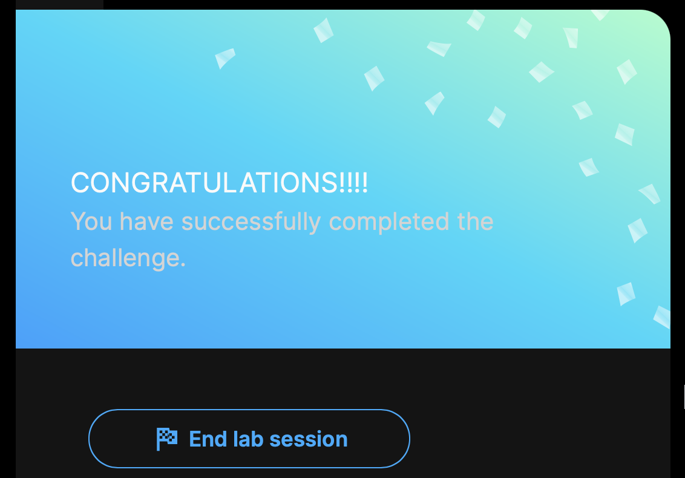

---

# Unit 2: Docker Images and Containers

## Docker Images

Images are read-only templates used to create containers.

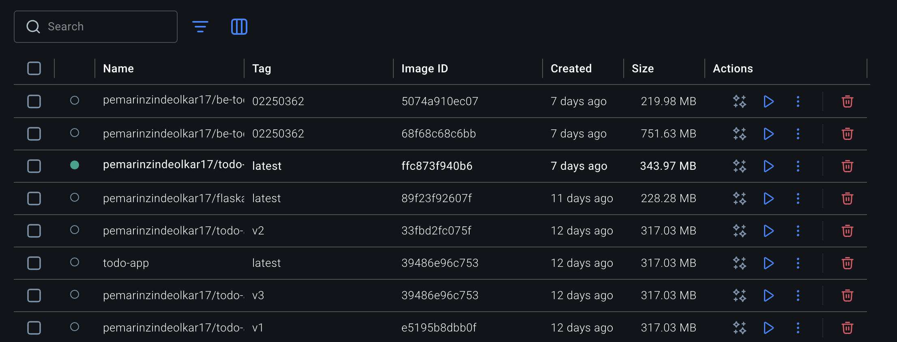

---

## Docker Containers

Containers are running instances of Docker images.

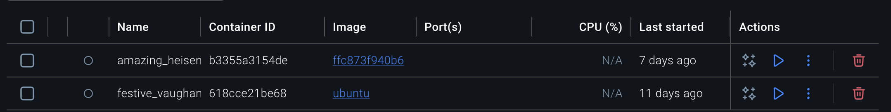

---

## Essential Commands

```bash id="u2cmds"
docker run <image>
docker ps
docker ps -a
docker stop <container>
docker start <container>
docker restart <container>
docker rm <container>
docker images
docker rmi <image>
```

---

## Running Containers

```bash id="u2run"
docker run nginx
docker run -it ubuntu bash
```

---

## Port Mapping

```bash id="u2ports"
docker run -p 8080:80 nginx
```

---

## Detached Mode

```bash id="u2detach"
docker run -d nginx
```

---

## Viewing Logs

```bash id="u2logs"
docker logs <container_id>
```

---

## Docker Exec - Running Commands in Containers

Docker Exec allows you to execute commands inside a running container.

### Check OS inside container

```bash id="u2exec1"
docker exec <container_id> cat /etc/os-release
```

### Interactive shell

```bash id="u2exec2"
docker exec -it <container_id> bash
```

## Docker Lab

Lab Docker Images
Answers
1. 9
2. 7.81 MB
3. 1.14 - alpine
4. python:3.6
5. /opt
6. python app.py
7. 8080
8. 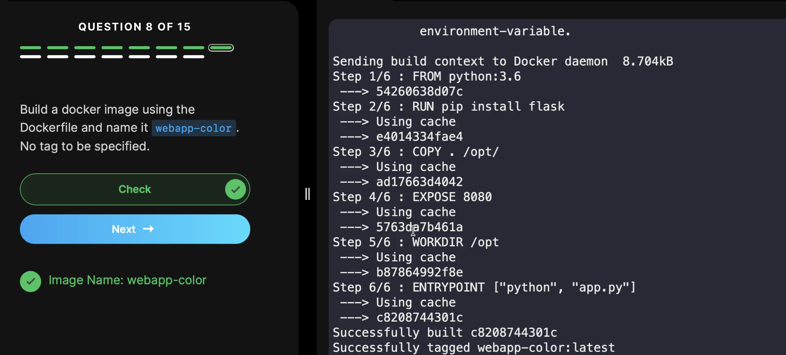
9. docker run -p 8282 : 8080 webapp-color
10. correct - ok
11. Debian
12. 920 MB
13. 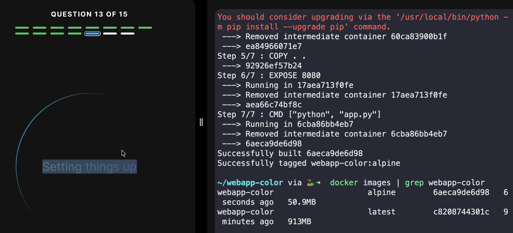
14. 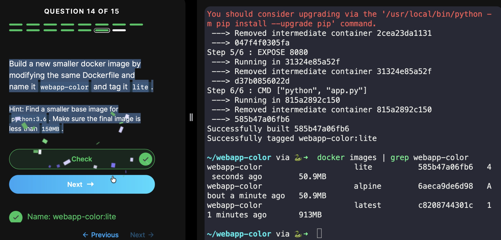
15. 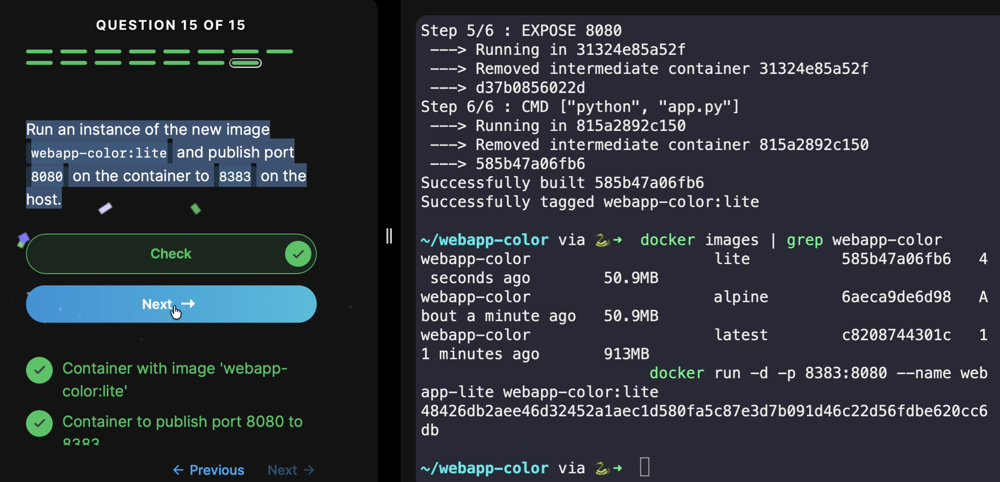

## Completion of Lab
 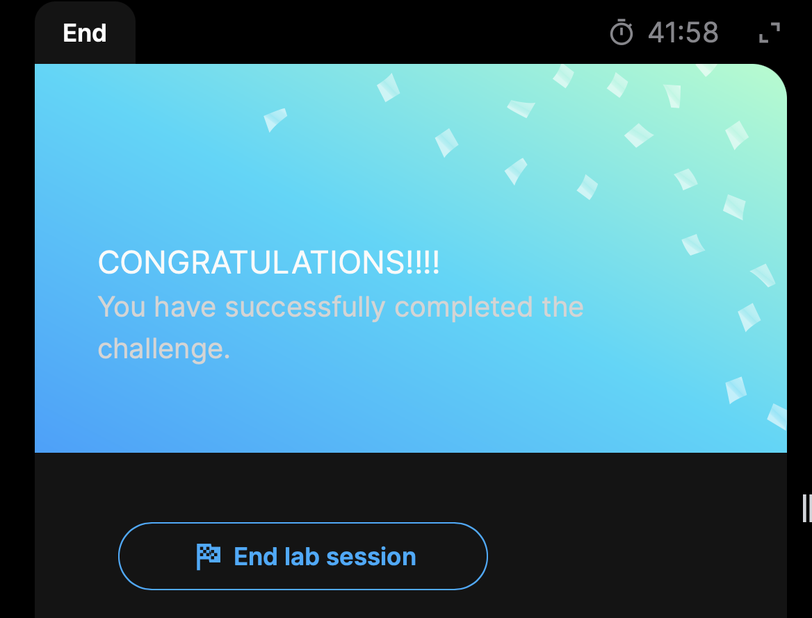

---

# Unit 3: Dockerfile and Docker Compose

## What is a Dockerfile?

A Dockerfile is a script that contains instructions to build a Docker image.

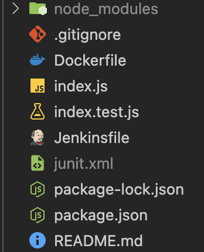

---

## Dockerfile

```dockerfile id="u3dockerfile"
FROM node:22-alpine

WORKDIR /app

COPY package.json .

RUN npm install

COPY . .

CMD ["npm", "start"]
```

---

## Build Image from Dockerfile

```bash id="u3build"
docker build -t my-app .
```

---

## Run Built Image

```bash id="u3run"
docker run -p 3000:3000 my-app
```

---

## Docker Compose

Docker Compose is used to run multi-container applications.

---

## Example docker-compose.yml

```yaml id="u3compose"
version: '3'
services:
  web:
    image: nginx
    ports:
      - "8080:80"

  app:
    build: .
    ports:
      - "3000:3000"
```

---

## Docker Compose Commands

```bash id="u3composecmds"
docker-compose up
docker-compose down
docker-compose build
```

---

## Volumes (Data Persistence)

```bash id="u3volumes"
docker run -v myvolume:/data nginx
```

---

## Networks

```bash id="u3network"
docker network ls
docker network create mynetwork
```

---

## Optimize Docker Image for Production + Security

### Multi-Stage Build (Smaller Image)

```dockerfile
FROM node:22-alpine AS builder
WORKDIR /app
COPY package*.json ./
RUN npm ci --only=production

FROM node:22-alpine
WORKDIR /app
COPY --from=builder /app/node_modules ./node_modules
COPY . .
CMD ["node", "server.js"]
```

### .dockerignore (Create this file)

```text
node_modules/
.git/
.env
*.log
```

### Non-Root User (Security)

```dockerfile
RUN addgroup -g 1001 -S appuser && adduser -S appuser -u 1001
USER appuser
```

### Image Scanning

```bash
docker scout quick my-app
trivy image my-app
```

### Resource Limits

```bash
docker run --memory="512m" --cpus="1" --read-only my-app
```

---


# Unit IV: CI/CD and Jenkins

## What is CI/CD?

**Continuous Integration** – Developers merge code into a shared branch multiple times a day. Each merge triggers an automatic build and runs unit tests. Catches problems immediately.

**Continuous Delivery** – Code is always ready to deploy. But a person presses the button to actually send it to production. Good for businesses that need human approval.

**Continuous Deployment** – Fully automated. Every change that passes all tests goes straight to production. No human click needed.

**The pipeline flow:**
Commit → Build → Unit Tests → Integration Tests → Deploy to Staging → (Manual approval for Delivery) → Production

**Why use it?**
- Find bugs early when they're cheap to fix
- Deploy more often with less stress
- Stop wasting time on manual testing and release steps
- Team gains confidence to deploy anytime

**Challenges:**
- Takes time to set up properly
- Requires good test coverage (bad tests = bad pipeline)
- Team needs to change how they work

---

## Jenkins Architecture

**Master (or Controller)**
- Manages everything
- Schedules jobs
- Serves the web UI at port 8080
- Stores configuration
- Doesn't do the actual building

**Agents (or Nodes)**
- Do the actual work of building and testing
- Can run on different operating systems
- Master tells them what to run
- More agents = parallel builds

**Why separate?** You can have one master managing many agents. Master stays lightweight. Agents can be powerful machines or even containers.

---

## Jenkins Job Types

**Freestyle Project**
- Configure everything through the web UI
- Good for simple stuff
- Not version controllable
- Losing popularity

**Pipeline (Recommended)**
- Define build process in a Jenkinsfile
- Stored in your code repository
- Can be reviewed like any other code
- Survives Jenkins restarts

**Multibranch Pipeline**
- Automatically creates pipelines for each branch
- Uses Jenkinsfile from that branch
- Main branch → Production
- Feature branches → Test first

---

## Jenkinsfile Basics (Declarative Syntax)

```groovy
pipeline {
    agent any  // run on any available agent
    
    stages {
        stage('Build') {
            steps {
                echo 'Compiling code...'
                sh 'mvn compile'
            }
        }
        
        stage('Test') {
            steps {
                sh 'mvn test'
            }
        }
        
        stage('Package') {
            steps {
                sh 'mvn package'
            }
        }
    }
    
    post {
        always {
            echo 'This runs no matter what'
            junit '**/surefire-reports/*.xml'
        }
        success {
            echo 'Pipeline succeeded!'
        }
        failure {
            echo 'Something broke'
        }
    }
}
```
## Key parts:

- `agent` – Where to run (any, label, docker, none)
- `stages` – Container for all your stage blocks
- `stage` – Logical section like Build, Test, Deploy
- `steps` – Actual commands to execute
- `post` – Cleanup based on result (always, success, failure, unstable)

---

## Build Triggers

How to start a pipeline automatically:

| Trigger | How it works |
|---------|---------------|
| Poll SCM | Jenkins checks Git every X minutes for changes |
| GitHub webhook | GitHub pushes a notification to Jenkins on every commit |
| Build periodically | Cron schedule (e.g., 2 AM daily for nightly tests) |
| Upstream trigger | Start this job after another job finishes |
| Generic trigger | Any system can call Jenkins API |


---

## Plugins

Jenkins is basically useless without plugins. Core is just the engine.

**Essential plugins:**
- Git – Clone repositories
- Pipeline – Run Jenkinsfile pipelines
- JUnit – Parse and display test results
- Blue Ocean – Modern UI
- Docker – Build and run containers
- Slack/Email – Notifications

**How to install:** Manage Jenkins → Plugins → Available tab → Search → Install

---

## Build Steps and Post-Build Actions

**Build steps** are what actually happens in your pipeline:
- Execute shell script
- Run Maven/Gradle/npm command
- Invoke another job
- Copy files

**Post-build actions** happen after:
- Publish test reports (so Jenkins shows pass/fail trends)
- Archive artifacts (save JAR/WAR files)
- Send email if build failed
- Trigger dependent jobs
- Deploy to server

---
## What is GitHub Actions?

CI/CD platform built into GitHub. No external server needed.

## Core Concepts

| Concept | Meaning |
|---------|---------|
| Workflow | YAML file in .github/workflows/ |
| Event | Trigger (push, pull_request) |
| Job | Set of steps on one runner |
| Action | Reusable component |

---

## Complete CI/CD with GitHub Actions

### Workflow File (.github/workflows/deploy.yml)

```yaml
name: CI/CD
on: push

jobs:
  test:
    runs-on: ubuntu-latest
    steps:
      - uses: actions/checkout@v3
      - uses: actions/setup-node@v3
        with:
          node-version: '18'
      - run: npm ci
      - run: npm test

  deploy:
    needs: test
    runs-on: ubuntu-latest
    if: github.ref == 'refs/heads/main'
    steps:
      - name: Deploy via SSH
        uses: appleboy/ssh-action@v0.1.5
        with:
          host: ${{ secrets.HOST }}
          username: ${{ secrets.USER }}
          key: ${{ secrets.SSH_KEY }}
          script: |
            cd /app
            git pull
            docker-compose up -d --build
```

### Setup Secrets (GitHub UI)

Settings → Secrets → Actions → Add:

- **HOST** = Server IP
- **USER** = SSH username
- **SSH_KEY** = Private key

### Deployment Methods

| Method | Command/Action |
|--------|----------------|
| SSH + Docker | appleboy/ssh-action |
| SCP Files | appleboy/scp-action |
| rsync | run: rsync -avz ./dist/ user@host:/var/www/ |

### Common Triggers

```yaml
on: 
  push: { branches: [main] }
  pull_request:
  workflow_dispatch:  # Manual button
  
```

# Unit V: Advanced Pipeline
### Defination of pipeline by sir
- it needs continous flow of automation
## Declarative vs Scripted Pipeline

### Declarative (what we've been using)

- Structured and opinionated
- Easier to read and write
- Blue Ocean visual editor works
- Best for 80% of use cases

### Scripted

- Full Groovy programming language
- More flexible and powerful
- Can use loops, if/else, try/catch naturally
- Steeper learning curve
- Use when Declarative is too limiting

### Example Comparison

**Declarative example:**

```groovy
pipeline {
    agent any
    stages {
        stage('Build') {
            steps { 
                sh 'make' 
            }
        }
    }
}
```

**Scripted example:**

```groovy
node('any') {
    stage('Build') {
        sh 'make'
        if (currentBuild.result == 'SUCCESS') {
            echo 'Build good'
        }
    }
}
```

### When to choose which

| Scenario | Recommendation |
|----------|----------------|
| New to Jenkins | Start Declarative |
| Need complex conditionals or loops | Scripted |
| Want to share library code | Scripted works better |
| Most production pipelines | Declarative is fine |

---

## Pipeline as Code

The main idea: Your pipeline definition lives in your code repository, not in Jenkins UI.


### Why this matters

- Pipeline changes go through code review
- Branch has its own pipeline (main vs feature)
- History of pipeline changes
- Can rollback pipeline like any other code

---

### Use in Jenkinsfile

```groovy
@Library('my-shared-library') _

pipeline {
    stages {
        stage('Deploy') {
            steps {
                slackNotify('Deploying to production')
            }
        }
    }
}
```

---

## Integrating External Tools

### Source Control (Git)

```groovy
stage('Checkout') {
    steps {
        git branch: 'main',
            url: 'https://github.com/myorg/myapp.git',
            credentialsId: 'github-creds'
    }
}
```

### Build Tools

**Maven:**

```groovy
stage('Build') {
    steps {
        sh 'mvn clean package'
    }
}
```

**npm/Node:**

```groovy
stage('Build') {
    steps {
        sh 'npm ci'
        sh 'npm run build'
    }
}
```

### Artifact Repositories (Nexus/Artifactory)

Store your built JARs, Docker images, or npm packages.

```groovy
stage('Upload') {
    steps {
        sh 'curl -u user:pass --upload-file myapp.war http://nexus/releases/'
    }
}
```

---

## Testing in Pipelines

### Unit Tests

```groovy
stage('Unit Tests') {
    steps {
        sh 'mvn test'
    }
    post {
        always {
            junit 'target/surefire-reports/*.xml'
        }
    }
}
```

The `junit` step parses test results. Jenkins shows a graph over time. Failing tests make the build unstable (yellow) instead of failing completely (red).

### Integration Tests

Test how services talk to each other. Often needs databases, message queues, or other services running.

### End-to-End Tests

Full browser or API tests. Slow but catch real user-facing issues.

### Test Types Summary

| Test Type | Speed | What it catches |
|-----------|-------|-----------------|
| Unit | Fast | Logic bugs |
| Integration | Medium | Service communication |
| E2E | Slow | Real user flows |

---

## Common Pipeline Patterns

### Parallel Execution

Run multiple tests at once to save time:

```groovy
stage('Parallel Tests') {
    parallel {
        stage('Unit') { 
            steps { 
                sh 'npm run test:unit' 
            } 
        }
        stage('Integration') { 
            steps { 
                sh 'npm run test:integration' 
            } 
        }
        stage('E2E') { 
            steps { 
                sh 'npm run test:e2e' 
            } 
        }
    }
}
```

### Conditional Execution

Only deploy if tests passed:

```groovy
stage('Deploy') {
    when { 
        branch 'main' 
    }
    steps { 
        sh 'deploy.sh' 
    }
}
```

### Post Actions

Run cleanup regardless of build status:

```groovy
post {
    always {
        echo 'This will always run'
        cleanWs()
    }
    success {
        echo 'Build succeeded!'
    }
    failure {
        echo 'Build failed!'
    }
}
```

### Environment Variables

```groovy
pipeline {
    environment {
        APP_NAME = 'myapp'
        VERSION = '1.0.0'
    }
    stages {
        stage('Print Version') {
            steps {
                echo "Building ${APP_NAME} version ${VERSION}"
            }
        }
    }
}
```

### Credentials Management

Never hardcode passwords:

```groovy
pipeline {
    environment {
        DOCKER_PASSWORD = credentials('docker-hub-creds')
    }
    stages {
        stage('Docker Login') {
            steps {
                sh 'echo $DOCKER_PASSWORD | docker login -u myuser --password-stdin'
            }
        }
    }
}
```

### Input Steps (Manual Approval)

```groovy
stage('Deploy to Production') {
    input {
        message "Deploy to production?"
        ok "Yes, deploy now"
        submitter "admin"
    }
    steps {
        sh 'deploy-prod.sh'
    }
}
```

---

## Best Practices Summary

| Practice | Why |
|----------|-----|
| Keep Jenkinsfile in SCM | Version control + code review |
| Use Declarative pipeline | Easier to read and maintain |
| Run parallel tests | Save time |
| Publish test results | Track quality over time |
| Use credentials plugin | Never hardcode secrets |
| Clean workspace | Prevent disk full issues |
| Use shared libraries | Don't repeat yourself |

---

## References

- Jenkins Pipeline Documentation: https://www.jenkins.io/doc/book/pipeline/
- Pipeline Syntax Reference: https://www.jenkins.io/doc/book/pipeline/syntax/
