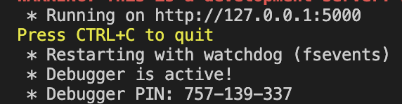
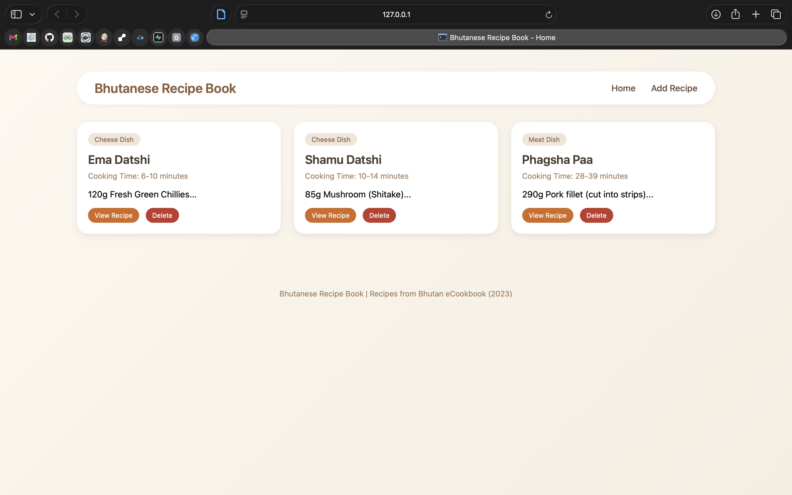
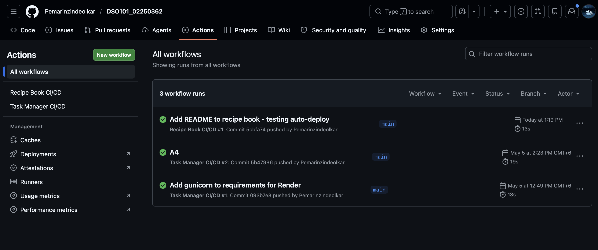
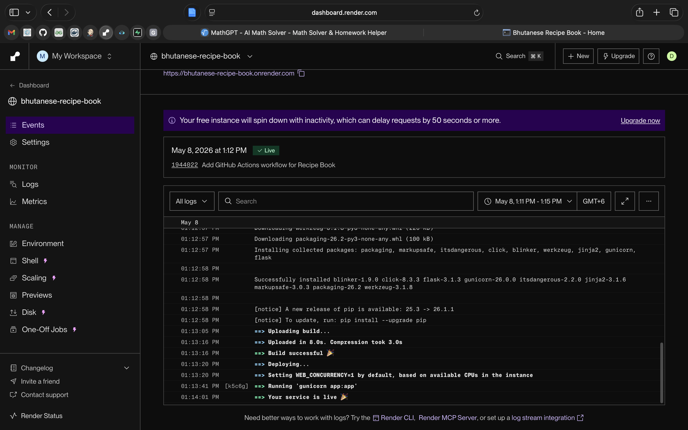
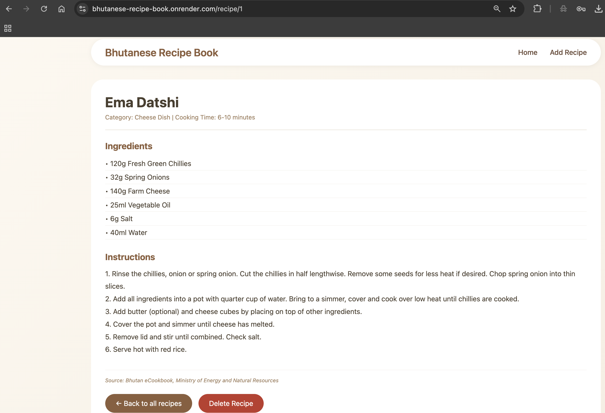

# Bhutanese Recipe Book - CI/CD Demo

## Live Demo

**Click here to view the live app:** https://bhutanese-recipe-book.onrender.com

---

## Project Overview

This is a fully functional Bhutanese Recipe Book web application that demonstrates how Continuous Integration and Continuous Deployment (CI/CD) works in real life. The project features authentic Bhutanese dishes from the official Bhutan eCookbook published by the Ministry of Energy and Natural Resources (2023).

The project uses three main technologies:

- **Flask** - A Python web framework that handles the backend logic
- **GitHub Actions** - Automatically runs tests and triggers deployment whenever code is pushed
- **Render** - A cloud platform that hosts the live application

---

## Features

- View authentic Bhutanese recipes including Ema Datshi (National Dish), Shamu Datshi, and Phagsha Paa
- Add new recipes with name, category, ingredients, and instructions
- View detailed recipe instructions with complete ingredient lists
- Delete recipes when no longer needed
- All recipes are saved automatically using a JSON file
- The website works on both mobile phones and desktop computers

---

## Pre-loaded Recipes

| Recipe Name | Category | Cooking Time |
|-------------|----------|--------------|
| Ema Datshi | Cheese Dish | 6-10 minutes |
| Shamu Datshi | Cheese Dish | 10-14 minutes |
| Phagsha Paa | Meat Dish | 28-39 minutes |

*Source: Bhutan eCookbook, Ministry of Energy and Natural Resources (2023)*

---

## Tech Stack

| Technology | Purpose |
|------------|---------|
| Python 3.13 | Backend programming language |
| Flask | Web framework for routing and rendering |
| HTML/CSS | Frontend structure and styling |
| JSON | Lightweight file-based data storage |
| Git | Version control system |
| GitHub Actions | CI/CD automation tool |
| Render | Cloud hosting platform |
| Gunicorn | Production web server for Python apps |

---

## CI/CD Pipeline Workflow

The CI/CD pipeline automates the process from code push to live deployment. Here is how it works in simple terms:

### What triggers the pipeline

Whenever code is pushed to the `main` branch on GitHub, and the changes are inside the `recipe-book` folder, the pipeline starts automatically.

### What happens step by step

| Step | Description |
|------|-------------|
| 1. Checkout code | GitHub Actions downloads the latest code from the repository |
| 2. Set up Python | The system installs Python version 3.13 on a temporary computer |
| 3. Install dependencies | The system runs `pip install -r requirements.txt` to install Flask and Gunicorn |
| 4. Verify the app | The system checks that the Flask app can load without errors |
| 5. Deploy to Render | Render pulls the latest code and restarts the live application |

### Why this is useful

- No manual deployment steps needed
- Every code change goes through the same automatic process
- If something breaks, you know immediately
- The live site is always up to date with the latest recipes

---

## Local Development Setup

Follow these steps to run the project on your own computer:

### Step 1: Clone the repository

```bash
git clone https://github.com/Pemarinzindeolkar/DSO101_02250362.git
cd DSO101_02250362/recipe-book
```

### Step 2: Install dependencies

```bash
pip install -r requirements.txt
```

### Step 3: Run the application

```bash
python app.py
```

### Step 4: Open your browser

Go to: **http://127.0.0.1:5000**

The application should now be running locally on your machine.

---

## Deployment Instructions for Render

Follow these steps to deploy the application yourself:

### Step 1: Push your code to a GitHub repository

### Step 2: Create an account at render.com

### Step 3: Connect your GitHub account to Render

### Step 4: Click "New Web Service" and select your repository (DSO101_02250362)

### Step 5: Configure the service with these settings

| Setting | Value |
|---------|-------|
| Name | `bhutanese-recipe-book` |
| Root Directory | `recipe-book` (important - tells Render where your app is) |
| Environment | Python 3 |
| Build Command | `pip install -r requirements.txt` |
| Start Command | `gunicorn app:app` |

### Step 6: Click "Create Web Service" and wait 2-3 minutes

### Step 7: Once deployed, Render provides a URL

```
https://bhutanese-recipe-book.onrender.com
```

---

## Screenshots

### Local Development




### GitHub Actions Workflow


### Successful Deployment on Render



### Live Application


---

## CI/CD Demonstration Evidence

| Requirement | Status | Where to verify |
|-------------|--------|-----------------|
| GitHub Repository | Complete | https://github.com/Pemarinzindeolkar/DSO101_02250362 |
| Flask Application | Working | Visit the live URL |
| GitHub Actions Workflow | Active | GitHub repo → Actions tab |
| Render Deployment | Live | https://bhutanese-recipe-book.onrender.com |

---

## Design Choices

### Color Palette

- **Background:** Warm cream gradient 
- **Text:** Rich brown tones for headers and body text
- **Cards, buttons, and forms:** White with subtle earthy borders
- **Accent Color:** Terracotta/Orange (#D2691E) for buttons and interactive elements

### Typography

- System fonts (SF Pro, Helvetica, Arial) for clean and fast loading
- No external font dependencies
- Clear hierarchy with larger recipe names and organized sections


### User Experience

- Recipe cards lift slightly when hovered
- Buttons change color on hover
- Flash messages confirm successful actions (add/delete)
- Confirmation dialog before deleting recipes
- Clear visual separation between recipe sections

---

## Authentic Bhutanese Recipes

The recipe book comes pre-loaded with three authentic Bhutanese dishes documented in the Bhutan eCookbook (2023), a publication by the Ministry of Energy and Natural Resources under the Clean Cooking Test (CCT) study.


---

## Note on Data Persistence

The application stores recipes in a file called `recipes.json` inside the `recipe-book` folder. On Render's free tier, this file persists between deployments but may reset after long periods of inactivity. For the purpose of this assignment (short-term demonstration), this is acceptable.

---

## References

- Bhutan eCookbook (2023) - Ministry of Energy and Natural Resources, Royal Government of Bhutan
- Flask Documentation: https://flask.palletsprojects.com/
- GitHub Actions Documentation: https://docs.github.com/en/actions
- Render Documentation: https://render.com/docs
- Gunicorn Documentation: https://gunicorn.org/
- UNESCAP: www.unescap.org
- MECS Programme: www.mecs.org.uk
```