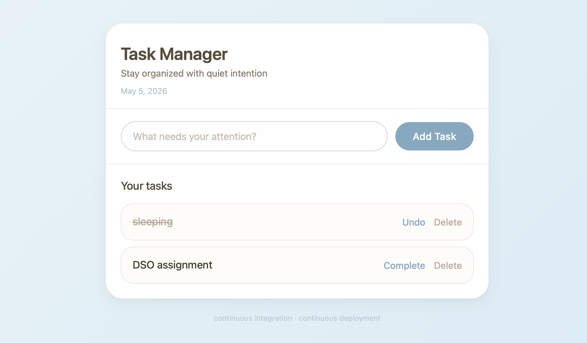
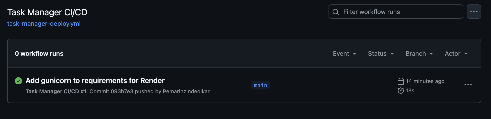
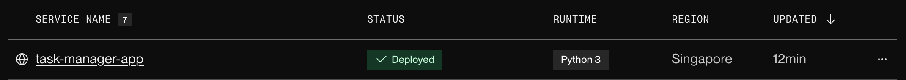
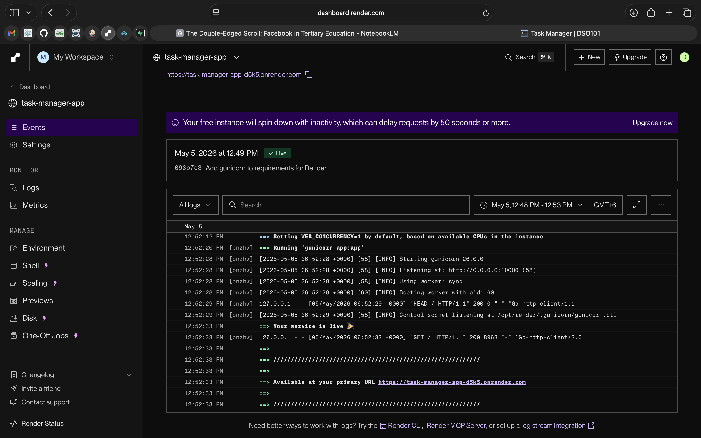
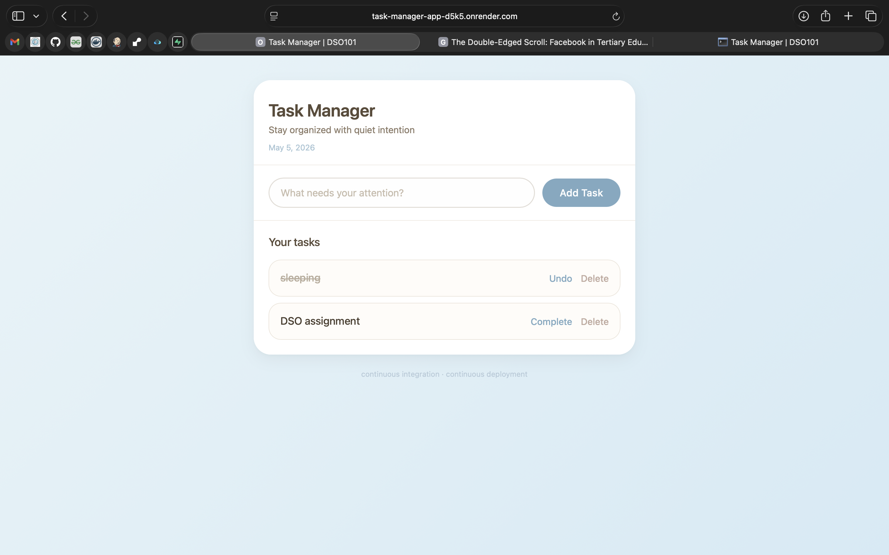

# Task Manager - CI/CD Demo

**Course:** Continuous Integration and Continuous Deployment (DSO101)  
**Program:** Bachelor of Engineering in Software Engineering  
**Submission Date:** 13th May 2026

---

## Live Demo

**Click here to view the live app:** `https://dashboard.render.com/web/srv-d7sp4tbrjlhs73cuu4g0`

---

## Project Overview

This is a fully functional Task Manager web application that demonstrates how Continuous Integration and Continuous Deployment (CI/CD) works in real life. The project uses three main technologies:

- **Flask** - A Python web framework that handles the backend logic
- **GitHub Actions** - Automatically runs tests and triggers deployment whenever code is pushed
- **Render** - A cloud platform that hosts the live application

### Features

- Add new tasks using the input form
- Mark tasks as complete or incomplete with one click
- Delete tasks when no longer needed
- All tasks are saved automatically using a JSON file
- The website works on both mobile phones and desktop computers
- Clean design with sky blue, brown, and white color scheme

---

## Tech Stack

| Technology | Purpose |
|------------|---------|
| Python 3.13 | Backend programming language |
| Flask | Web framework for routing and rendering |
| HTML/CSS | Frontend structure and styling |
| JSON | Lightweight file-based data storage |
| Git | Version control system |
| GitHub Actions | CI/CD automation tool |
| Render | Cloud hosting platform |
| Gunicorn | Production web server for Python apps |

---

## CI/CD Pipeline Workflow

The CI/CD pipeline automates the process from code push to live deployment. Here is how it works in simple terms:

### What triggers the pipeline

Whenever code is pushed to the `main` branch on GitHub, and the changes are inside the `task-manager` folder, the pipeline starts automatically.

### What happens step by step

| Step | Description |
|------|-------------|
| 1. Checkout code | GitHub Actions downloads the latest code from the repository |
| 2. Set up Python | The system installs Python version 3.13 on a temporary computer |
| 3. Install dependencies | The system runs `pip install -r requirements.txt` to install Flask and Gunicorn |
| 4. Verify the app | The system checks that the Flask app can load without errors |
| 5. Deploy to Render | Render pulls the latest code and restarts the live application |

### Why this is useful

- No manual deployment steps needed
- Every code change goes through the same automatic process
- If something breaks, you know immediately
- The live site is always up to date with the latest code

---


## Local Development Setup

Follow these steps to run the project on your own computer:

### Step 1: Clone the repository

```bash
git clone https://github.com/Pemarinzindeolkar/DSO101_02250362.git
cd DSO101_02250362/task-manager
```

### Step 2: Install dependencies

```bash
pip install -r requirements.txt
```

### Step 3: Run the application

```bash
python app.py
```

### Step 4: Open your browser

Go to: **http://127.0.0.1:5000**


The application should now be running locally on your machine.

---

## Deployment Instructions for Render

Follow these steps to deploy the application yourself:

### Step 1: Push your code to a GitHub repository

### Step 2: Login at render.com

### Step 3: Connect your GitHub account check GitHub actions for verfication. For easier access on Render


### Step 4: Click "New Web Service" and select your repository (DSO101_02250362)

### Step 5: Configure the service with these settings

| Setting | Value |
|---------|-------|
| Name | Any name you prefer (example: task-manager-app) |
| Root Directory | `task-manager` (important - this tells Render where your app is) |
| Environment | Python 3 |
| Build Command | `pip install -r requirements.txt` |
| Start Command | `gunicorn app:app` |

### Step 6: Click "Create Web Service" and wait 2-3 minutes


### Step 7: Once deployed, Render provides a URL
https://task-manager-app-d5k5.onrender.com/




---


## CI/CD Demonstration Evidence

| Requirement | Status | Where to verify |
|-------------|--------|-----------------|
| GitHub Repository | Complete | https://github.com/Pemarinzindeolkar/DSO101_02250362 |
| Flask Application | Working | Visit the live URL |
| GitHub Actions Workflow | Active | GitHub repo → Actions tab |
| Render Deployment | Live | The deployed URL works |

---

## Design Choices

### Color Palette

- **Background:** Soft sky blue gradient
- **Text:** Warm brown tones for headers and body text
- **Cards, buttons, and forms:** White with subtle borders

### Typography

- System fonts (SF Pro, Helvetica, Arial) for clean and fast loading
- No external font dependencies

### Responsive Design

- The layout adapts to different screen sizes
- On mobile phones, the form stacks vertically and buttons are larger
- On desktop, the form is horizontal with more spacing

### User Experience

- Buttons change color when hovered over
- Task items have a subtle shadow on hover
- Smooth transitions for all interactive elements

---

## Note on Data Persistence

The application stores tasks in a file called `tasks.json` inside the `task-manager` folder. On Render's free tier, this file persists between deployments but may reset after long periods of inactivity. For the purpose of this assignment (short-term demonstration), this is acceptable.

---

## References

- Flask Documentation: https://flask.palletsprojects.com/
- GitHub Actions Documentation: https://docs.github.com/en/actions
- Render Documentation: https://render.com/docs
- Gunicorn Documentation: https://gunicorn.org/
