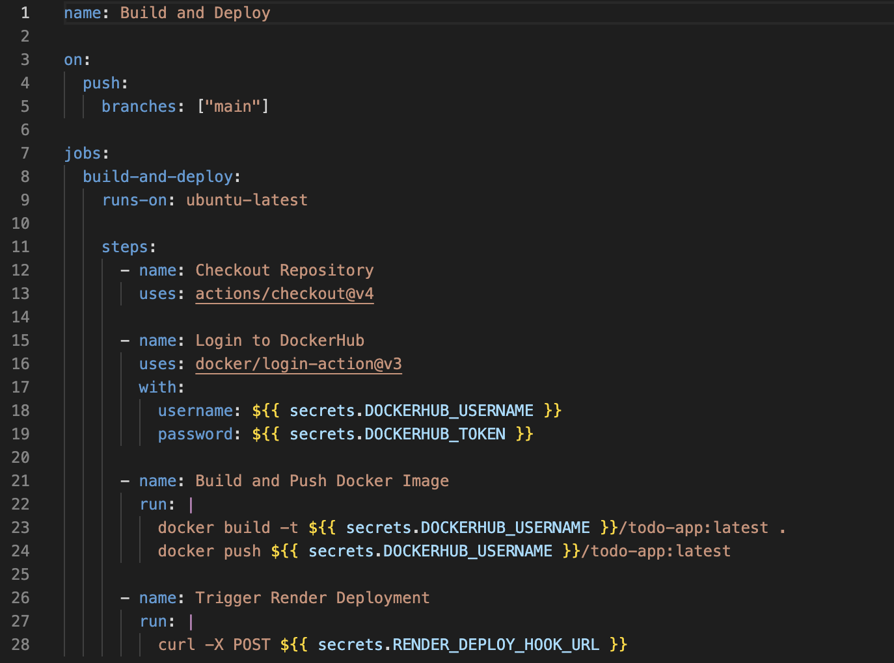
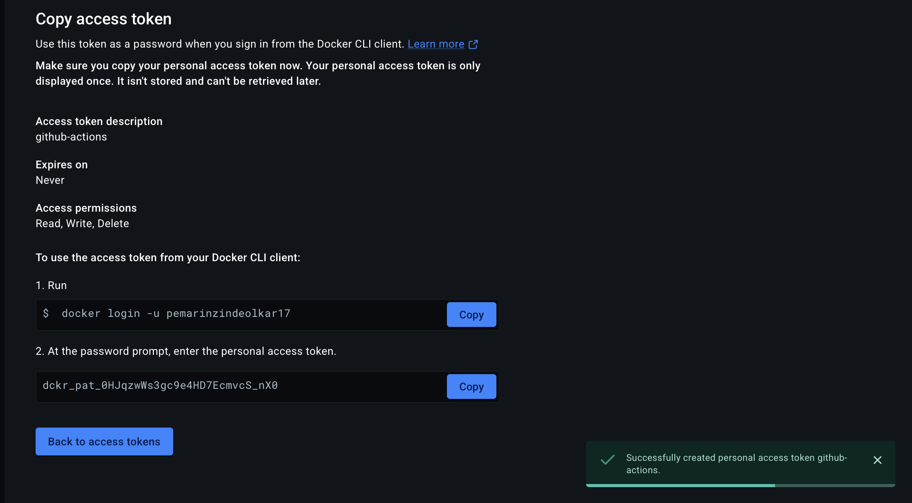
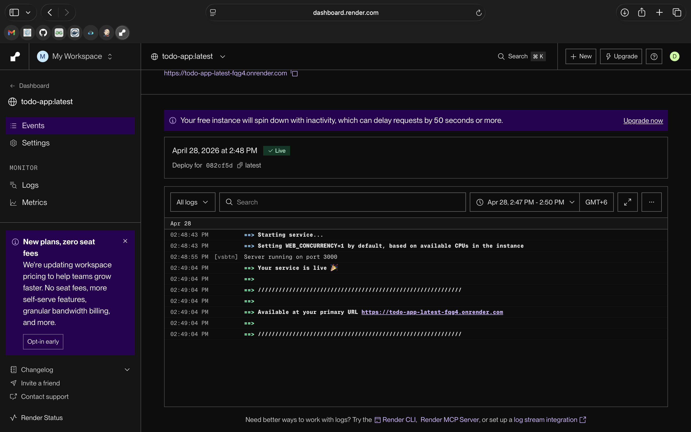
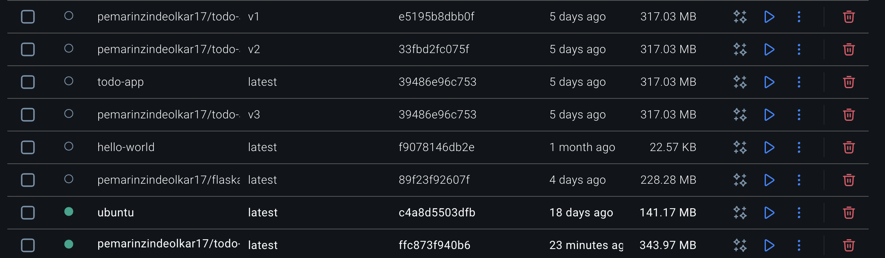

# README for DSO101_A3
# 02250362
## Aim
Understanding how a CI/CD pipeline is to be implemented automatically for the Node.js application.
Containerizing the application using Docker and managing images using DockerHub.
Implementing building, testing, and deployment of applications using GitHub Actions.
Deploying the containerized application on a cloud platform (Render.com), without any configuration of the server side manually.

## Objectives
- Create a Dockerfile that properly packs a Node.js (Express) to-do list application inside the Docker image.
- Setup GitHub Actions such that:
  - Docker image is built automatically whenever a commit happens on the main branch.
  - Docker login happens securely through GitHub Secrets to DockerHub.
  - The image is then pushed to DockerHub.
  - Webhook is triggered to initiate the deployment process in Render.com.
- Finally deploy Docker container image from DockerHub into Render.com.
- Check for correctness with:
  - A successful GitHub Actions workflow job run.
  - Presence of Docker image in DockerHub.
  - Application availability in Render.com.

# BACKGROUND INFORMATION

CI/CD refers to the process that involves building, testing, and deploying code automatically. This approach is useful for web applications because it avoids manual interventions and minimizes mistakes.

## Why Docker?
A Docker container encapsulates the application and all dependencies for it. The same container will have the application running consistently across your development machine, test server, and production environment. For our assignment, we utilize a Node.js (Alpine) base image to make the container light.

## Why GitHub Actions?
GitHub Actions provides a CI/CD solution within the GitHub repository itself. It helps us write workflow files (YAML) that run based on particular events (push to main branch). A workflow file comprises multiple jobs, and each job comprises different steps (checkout code, build docker image, push to registry, etc).

## Why Dockerhub & Render.com?
Dockerhub serves as a registry where we will host our Docker containers.

Render is a Platform-as-a-Service (PaaS) that can take an image hosted on Dockerhub and spin up the image as a running web application. Unlike a traditional hosting approach, render will assign an automatic URL, automate the process, and even redeploy whenever a new image is pushed (only when triggered by us using a webhook).

## Security rule
The credentials (DockerHub username/token, Render webhook URL) should never be hard-coded. Instead, they are stored as GitHub Secrets and accessed within the workflow YAML file.

## PROCEDURES

### Task 1: Repository & Dockerfile Preparation

- Verified `package.json` – it contains `"start"` and `"test"` scripts.
- Made the repository public (as required for simplicity).
- Created a Dockerfile in the root of the project:

```dockerfile
# Use Node.js LTS (Alpine for small size)
FROM node:20-alpine

# Set working directory inside container
WORKDIR /app

# Copy package files first
COPY package*.json ./

# Install dependencies
RUN npm install

# Copy the rest of the application code
COPY . .

# Run tests during build 
RUN npm test

# Expose the port the app listens on
EXPOSE 3000

# Start the application
CMD ["npm", "start"]
```

### Local Testing

Tested locally by building and running the container:

```bash
docker build -t todo-app .
docker run -p 3000:3000 todo-app
```

### Task 2: GitHub Actions Workflow

Created the folder `.github/workflows/` and added `deploy.yml`:

```yaml
name: CI/CD Pipeline

on:
  push:
    branches: ["main"]

jobs:
  build-and-deploy:
    runs-on: ubuntu-latest

    steps:
      - name: Checkout Repository
        uses: actions/checkout@v4

      - name: Login to DockerHub
        uses: docker/login-action@v3
        with:
          username: ${{ secrets.DOCKERHUB_USERNAME }}
          password: ${{ secrets.DOCKERHUB_TOKEN }}

      - name: Build and Push Docker Image
        run: |
          docker build -t ${{ secrets.DOCKERHUB_USERNAME }}/todo-app:latest .
          docker push ${{ secrets.DOCKERHUB_USERNAME }}/todo-app:latest

      - name: Trigger Render Deployment
        run: |
          curl -X POST ${{ secrets.RENDER_DEPLOY_HOOK }}
```



### Task 3: Adding GitHub Secrets

In the GitHub repository → Settings → Secrets and variables → Actions I added:

| Secret name | Value |
|-------------|-------|
| DOCKERHUB_USERNAME | my_dockerhub_username |
| DOCKERHUB_TOKEN | (generated from DockerHub → Account Settings → Security) |
| RENDER_DEPLOY_HOOK | (the webhook URL from Render – see Task 4) |



### Task 4: Deploy on Render.com

Logged into Render.com.

Clicked New + → Web Service.

Choose "Deploy from existing image".

Entered the DockerHub image path: my_dockerhub_username/todo-app:latest.

Set the following configuration:

- Name: todo-app-ci
- Environment: Docker
- Port: 3000
- Start Command: (leave blank – uses Docker CMD)

Clicked Create Web Service.

After deployment, Render provided a public URL

Obtained the webhook URL from Render: Settings → Deploy Hooks → Create Hook → copy the URL.

I then added that URL as the RENDER_DEPLOY_HOOK secret in GitHub.



## FINAL VERIFICATION

- GitHub Actions - any push to the main branch launches the green action.
- DockerHub - there is a todo-app:latest image with the latest date stamp.
- Render - the live app is available, and upon a push, Render redeployed it (due to the webhook).




## CONCLUSION

In conducting this exercise, there were a few technical difficulties which I experienced at the beginning that took time to solve but ultimately helped me learn more about CI/CD. First, I faced the problem where my application was not building successfully in Docker when trying to build it locally. It had something to do with the node_modules directory being copied from my computer into the container since the node_modules directory could not work well with the Node.js on Linux container image. After some investigation, I found out that the solution is to have the .dockerignore file that excludes the node_modules and allows the running of npm install on the Docker image. With that, I learned more about Docker image layers and how important it is to have a clean build context.

The most surprising issue turned out to be that of Render's behavior following a deployment of a new Docker image. I expected the service to automatically detect the change in the latest tag on DockerHub and deploy. But the instructions for the assignment stated that it does not happen automatically and needed to be done via webhook trigger with a curl command. The first attempt involved writing the webhook URL directly into the YAML file. But the assignment warned about the dangers of doing such a thing because it is considered insecure practice. The URL was then placed into the RENDER_DEPLOY_HOOK GitHub secret, which served its purpose well.

Finally, there was a port mismatch problem between my to-do list application listening at port 5000 by default, while Docker exposed 3000 and Render expected port 3000. In the end, I learned that most of the cloud providers have an environment variable named "PORT" so I modified the Node.js code in such a way that it uses process.env.PORT or 3000.

All issues described above have become a good source of learning. Now, I know how to create a ready-for-production Docker file, how to build a safe CI/CD pipeline with GitHub actions, how to upload an image to a container registry and deploy images to the server. Moreover, it is crucial to read error messages and find solutions in platform-specific documentation instead of making assumptions about what particular service may or may not do.

